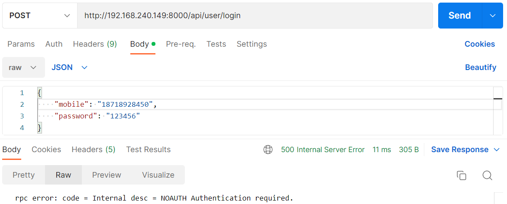

## 开发常见问题处理

### NOAUTH Authentication required

1. 现象

   

2. 解决方案

   `rpc` yaml配置文件中redis配置需要添加密码，如下：
   ```text
    Redis:
        Key: rpc:auth:user
        Host: 127.0.0.1:6379
        Pass: 123456
    ```
