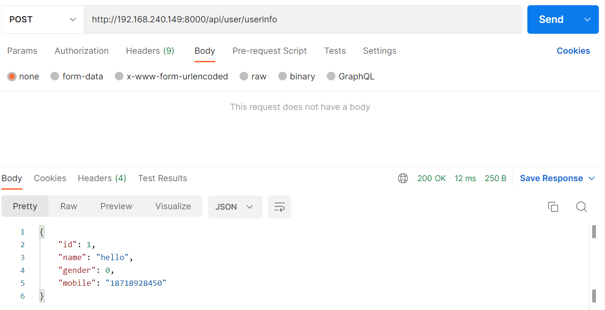
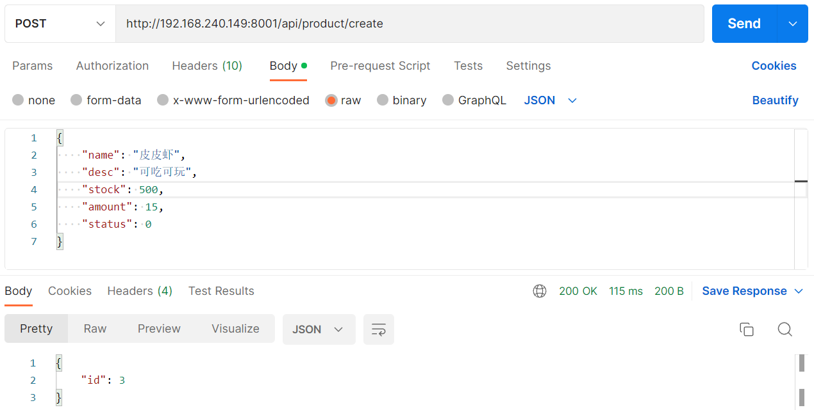
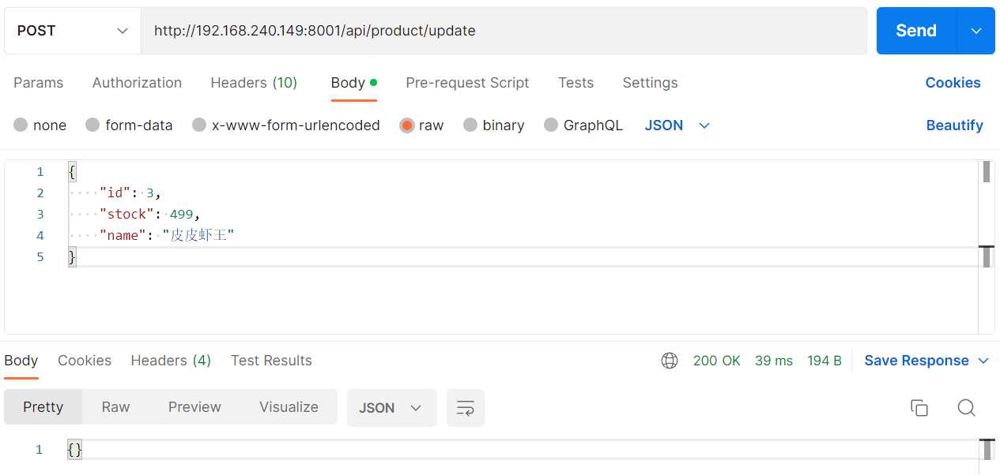
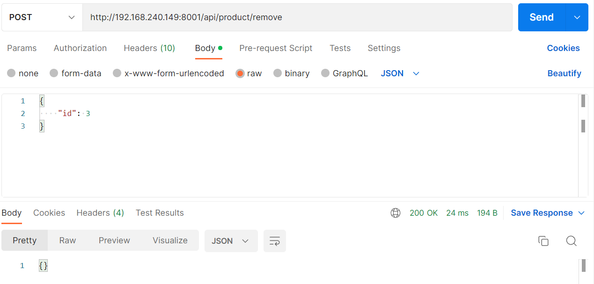
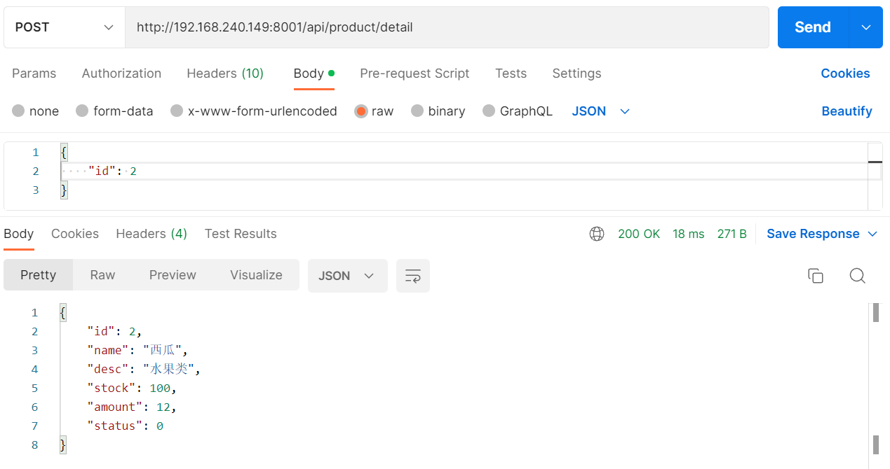

# 项目启动

## USER

```shell
go run service/user/rpc/user.go -f service/user/rpc/etc/user.yaml
go run service/user/api/user.go -f service/user/api/etc/user.yaml
```

## PRODUCT

```shell
go run service/product/rpc/product.go -f service/product/rpc/etc/product.yaml
go run service/product/api/product.go -f service/product/api/etc/product.yaml
```

## ORDER

```shell
go run service/order/rpc/order.go -f service/order/rpc/etc/order.yaml
go run service/order/api/order.go -f service/order/api/etc/order.yaml
```

## PAY

```shell
go run service/pay/rpc/pay.go -f service/pay/rpc/etc/pay.yaml
go run service/pay/api/pay.go -f service/pay/api/etc/pay.yaml
```

# 路由请求

## USER

> /api/user/userinfo



## PRODUCT

> /api/product/create



> /api/product/update



> /api/product/remove



> /api/product/detail

